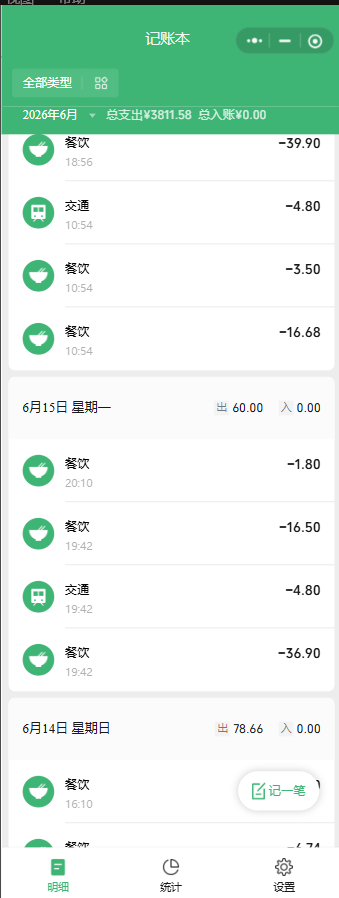
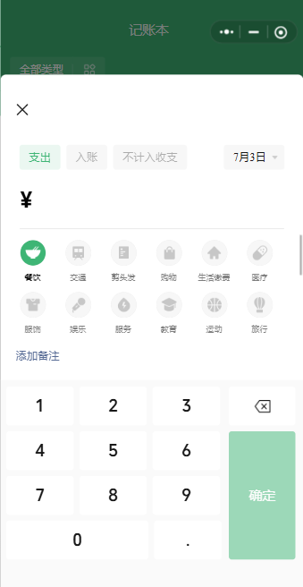
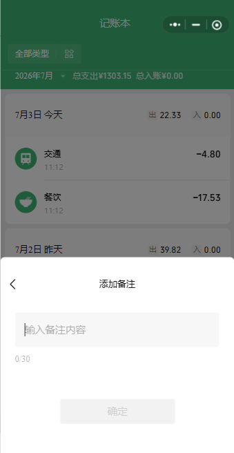
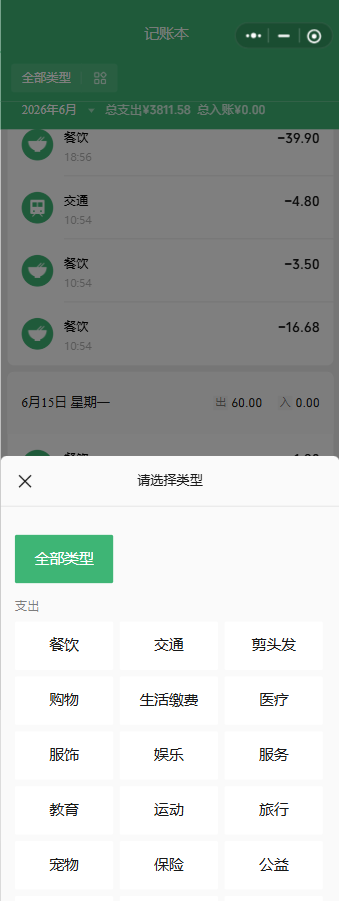
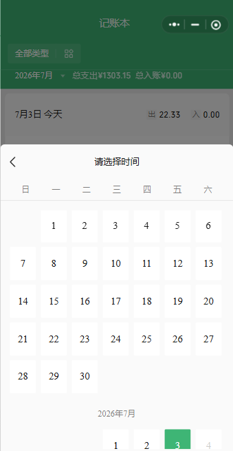
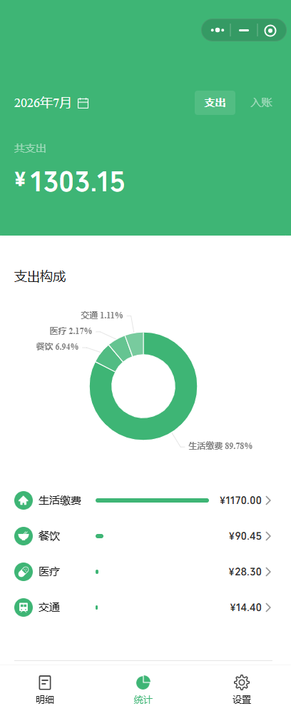
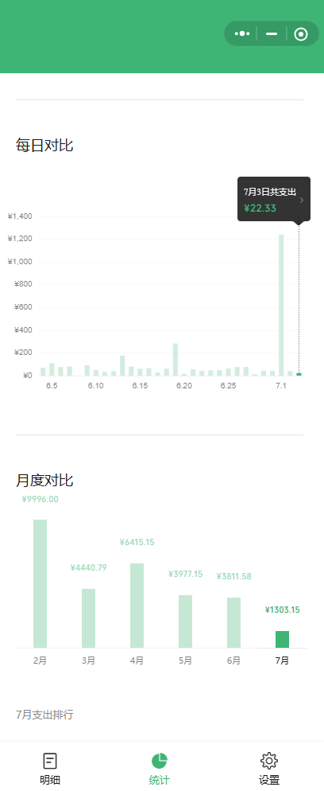
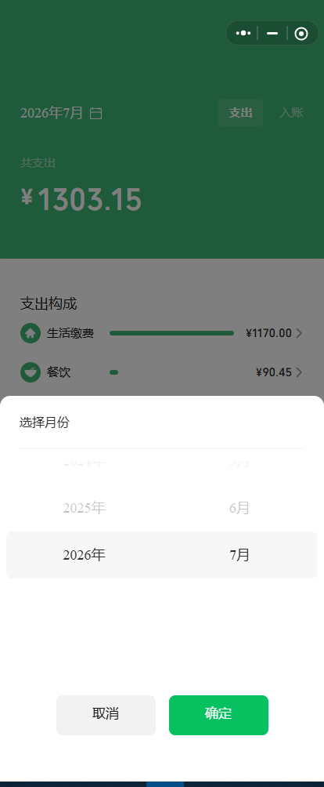
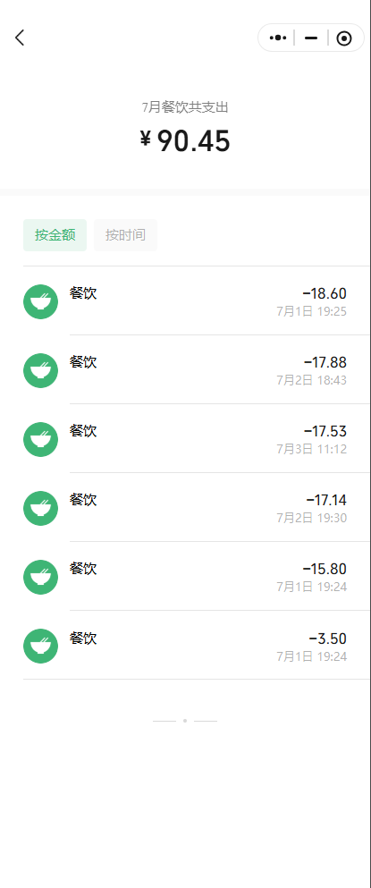

# Design: 记账首页和统计功能

## UI References

下面的图片只作为 UI 布局和交互参考。代码实现时，如果需要显示分类图标、占位图片或临时图标，统一引用 `R.mipmap.ic_launcher`。

### 明细首页

说明：
- 展示当前月份账单。
- 支持类型筛选和月份筛选。
- 显示总支出和总入账。
- 账单按日期分组展示。
- 右下角提供“记一笔”入口。

### 新增记账

说明：
- 从明细首页点击“记一笔”进入。
- 支持选择支出、入账、不计入收支。
- 支持输入金额、选择分类、选择日期和添加备注。
- 分类图标实现时统一使用 `R.mipmap.ic_launcher`。

### 添加备注

说明：
- 从新增记账页面进入备注输入。
- 用户可以输入账单备注。
- 备注确认后返回新增记账流程。

### 类型筛选弹窗

说明：
- 从明细首页点击“全部类型”或当前分类按钮打开。
- 用户选择分类后关闭弹窗。
- 选择结果返回明细页并作为列表筛选条件。

### 日期选择弹窗

说明：
- 用于新增记账时选择具体日期。
- 用户选择日期后，新增记账页面显示对应日期。

### 统计首页

说明：
- 展示选中月份的统计数据。
- 支持支出和入账切换。
- 显示总金额、分类占比图和分类排行。

### 统计滚动内容

说明：
- 统计页向下滚动后展示每日对比和月度对比。
- 图表数据来自本地 Room 数据库中的账单记录。

### 年月选择弹窗

说明：
- 用于明细页和统计页选择年月。
- 点击取消关闭弹窗，不改变当前筛选条件。
- 点击确定关闭弹窗，并把选择的年月作为筛选条件。

### 统计分类详情

说明：
- 从统计页分类排行进入。
- 展示当前月份、当前分类下的账单列表。
- 支持按金额和按时间排序。

## Implementation Notes

- 设计图中的分类图标只代表分类位置和视觉结构。
- 本期实现不需要逐个制作分类专属图标。
- 所有分类图标先统一使用 `R.mipmap.ic_launcher`。
- App 不加载网络图片。
- App 不请求网络数据。
